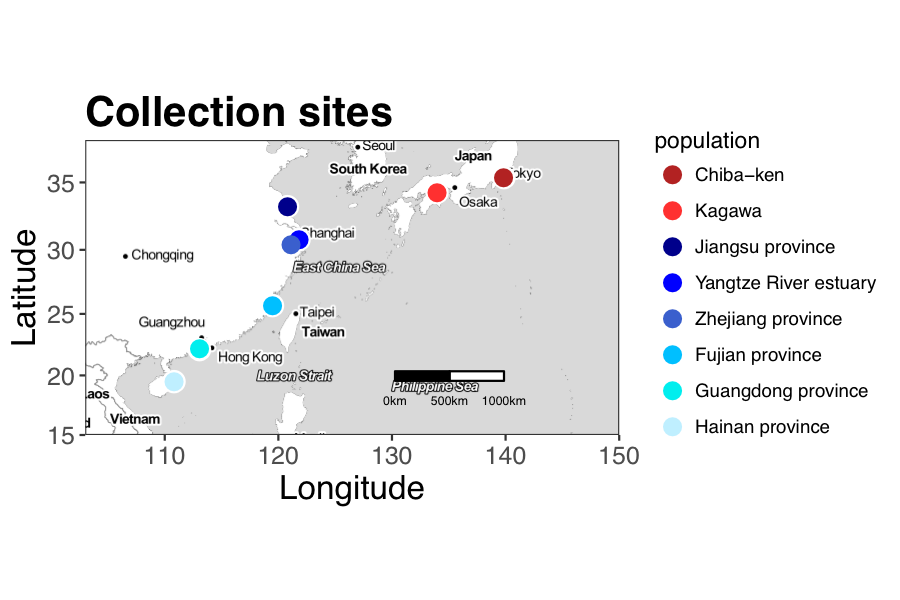

<!-- START doctoc generated TOC please keep comment here to allow auto update -->
<!-- DON'T EDIT THIS SECTION, INSTEAD RE-RUN doctoc TO UPDATE -->
**Table of Contents**  *generated with [DocToc](https://github.com/thlorenz/doctoc)*

- [RADseq of Japanese Eels](#radseq-of-japanese-eels)
  - [Overview](#overview)
- [Prep sequencing data:](#prep-sequencing-data)
  - [Step 1: Trim PE reads using fastx-toolkit](#step-1-trim-pe-reads-using-fastx-toolkit)
  - [Step 2: Combine reads from two sequencing batches together](#step-2-combine-reads-from-two-sequencing-batches-together)
- [Prep data for STACKS](#prep-data-for-stacks)
  - [Step 1: Make accessory files for STACKS](#step-1-make-accessory-files-for-stacks)
  - [Step 2: QC and demultiplex the reads](#step-2-qc-and-demultiplex-the-reads)
  - [Step 3: Download and prep reference genome](#step-3-download-and-prep-reference-genome)
  - [Step 4: Map reads to the nuclear and mitochondrial genome](#step-4-map-reads-to-the-nuclear-and-mitochondrial-genome)
- [Create SNP catalog using STACKS](#create-snp-catalog-using-stacks)
  - [Step 1: Create stacks using a reference genome (ref_map)](#step-1-create-stacks-using-a-reference-genome-ref_map)
  - [Step 2: Run corrections module (rxstacks)](#step-2-run-corrections-module-rxstacks)
  - [Step 3: Reassemble the catalog after running corrections module](#step-3-reassemble-the-catalog-after-running-corrections-module)
  - [Step 4: Run populations module on catalog to calculate stats](#step-4-run-populations-module-on-catalog-to-calculate-stats)
  - [Step 5: Filter out samples with low calls and loci with high depth, rerun populations](#step-5-filter-out-samples-with-low-calls-and-loci-with-high-depth-rerun-populations)
    - [Final data sets](#final-data-sets)
- [Run analyses on final data set](#run-analyses-on-final-data-set)
  - [Create basic stats plots](#create-basic-stats-plots)
  - [Create phylogenetic trees from population level Fst](#create-phylogenetic-trees-from-population-level-fst)
  - [Run admixture](#run-admixture)
  - [Run PCA](#run-pca)

<!-- END doctoc generated TOC please keep comment here to allow auto update -->

RADseq of Japanese Eels
=======

This repo contains all of the scripts and log files used to process the RADseq data for the japanese eel project led by Xiaoling Gong.
Note that all analyses start in the base directory. 

Overview
-------
	project
	|- README							# Description of analyses performed
	|
	|- data/							# Any data put into analyses - may be raw or processed (note: not version controlled currently due to size)
	|    |- fastq_files					# original fastq files from Xiaoling (all merged, don't use)
	|    |- fastq_files_updated			# fastq files by lane and run 
	|
	|- log/								# Contains electronic lab notebook files, titled by date
	|
	|- scripts/							# Contains all scripts used to run analyses
	|
	|- results/							# Contains all output from scripts (note: not version controlled currently due to size)
	|    |- 0_fastqc					# FastQC reports of the original sequence files
	+
# Prep sequencing data:

Xiaoling obtained four sequencing files from the company who sequenced the eels (stored on cbsufsrv5 at `data2/japaneseEel/data/fastq_files_updated/`):

* 32manli1_R1.fastq.gz
* 32manli2_R1.fastq.gz
* 36manli2_R1.fastq.gz
* 36manli2_R2.fastq.gz

Files that start with 32 are the single-end libraries. 
Files that start with 36 are the paired-end libraries.
manli1 is library mix 1.
manli2 is library mix 2.
R1 are all forward reads (only read for single-end sequencing).
R2 are the paired end reads (where applicable). 

## Step 1: Trim PE reads using fastx-toolkit

The single-end reads were only sequenced to 100bp, while the paired-end reads were sequenced to 125bp.

Trim off the last 25 bases of the PE reads from `36manli2_R1.fastq.gz` so that all the fragments are the same length (using fastx-toolkit) [from `cbsulogin`]:

```
# Make new directory for output files:
mkdir /fs/cbsufsrv5/data2/japaneseEel/data/fastq_files_updated/36manli2_pe_trimmed/

# Unzip fastq.gz file:
gunzip /fs/cbsufsrv5/data2/japaneseEel/data/fastq_files_updated/36manli2_R1.fastq.gz

# Submit script to trip reads to 100bp:
qsub scripts/submit_fastx_trim_pe_reads.sh /fs/cbsufsrv5/data2/japaneseEel/data/fastq_files_updated/ 36manli2_R1.fastq /fs/cbsufsrv5/data2/japaneseEel/data/fastq_files_updated/36manli2_pe_trimmed/

# Zip up fastq file:
gzip /fs/cbsufsrv5/data2/japaneseEel/data/fastq_files_updated/36manli2_R1.fastq
```

## Step 2: Combine reads from two sequencing batches together 

Library 2 (li2) sequenced twice, once single-end and once paired-end.
Combining the forward reads two libraries together, using the trimmed PE reads [from `cbsufsrv5`]:

```
# Combine li2 files:
zcat data/fastq_files_updated/36manli2_pe_trimmed/36manli2_R1.fastq.gz data/fastq_files_updated/32manli2_R1.fastq.gz > ../data/fastq_files_updated/32_36_manli2_R1_merged.fastq

# zip up the merged file:
gzip data/fastq_files_updated/32_36_manli2_R1_merged.fastq
``` 

# Prep data for STACKS
## Step 1: Make accessory files for STACKS

First, make a barcode file for stacks [from `cbsulm06`]:

```
scripts/make_bcfiles_for_STACKS.R
```

Next, make a population map file for STACKS [from `cbsulm06`]:

```
scripts/make_population_map_file_for_STACKS.R
```

## Step 2: QC and demultiplex the reads

Finally, run `process_radtags` to QC the reads and demultiplex the samples [from `cbsulm06`]:

Process 32manli1 file:

```
/programs/stacks-1.48/bin/process_radtags \
	-f /fs/cbsufsrv5/data2/japaneseEel/data/fastq_files_updated/32manli1_R1.fastq.gz \
	-i 'gzfastq' \
	-o /fs/cbsufsrv5/data2/japaneseEel/data/STACKS_processed/0_process_radtags_out/ \
	-b data/sample_info/bcfile_manli1_for_stacks.txt \
	-c \
	-q \
	-D \
	-e 'kpnI' \
	--inline_null
```

Process merged manli2 file:

```
/programs/stacks-1.48/bin/process_radtags \
	-f /fs/cbsufsrv5/data2/japaneseEel/data/fastq_files_updated/32_36_manli2_R1_merged.fastq.gz \
	-i 'gzfastq' \
	-o /fs/cbsufsrv5/data2/japaneseEel/data/STACKS_processed/0_process_radtags_out/ \
	-b data/sample_info/bcfile_manli2_for_stacks.txt \
	-c \
	-q \
	-D \
	-e 'kpnI' \
	--inline_null
```

## Step 3: Download and prep reference genome

Downloaded the japanese eel nuclear and mtDNA genomes from (<http://www.ncbi.nlm.nih.gov/genome/?term=txid7937[Organism:noexp]>):

Nuclear source:  
<ftp://ftp.ncbi.nlm.nih.gov/genomes/all/GCA_000470695.1_japanese_eel_genome_v1_25_oct_2011_japonica_c401b400k25m200_sspacepremiumk3a02n24_extra.final.scaffolds/GCA_000470695.1_japanese_eel_genome_v1_25_oct_2011_japonica_c401b400k25m200_sspacepremiumk3a02n24_extra.final.scaffolds_genomic.fna.gz>

mtDNA source (send to fasta file and then gzipped):  
<http://www.ncbi.nlm.nih.gov/nuccore/595077858?report=fasta>

The mitochondrial genome is included in the nuclear source file, but we want to consider nuclear and mito DNA separately.

Use BBmap to remove that mito sequence [from `cbsulm06`]:

```
/programs/bbmap-35.66/filterbyname.sh \
	in=/fs/cbsufsrv5/data2/japaneseEel/genomes/a_japonica/GCA_000470695.1_japanese_eel_genome_v1_25_oct_2011_japonica_c401b400k25m200_sspacepremiumk3a02n24_extra.final.scaffolds_genomic.fna.gz \
	out=a_japonica_nuclear_genome.fasta \
	names=CM002536.1 \
	include=f
```

Unzip genome so Bowtie can build it:

```
gunzip /data/genomes/a_japonica/nuclear/a_japonica_nuclear_genome.fasta.gz 
```

Use Bowtie to make an index of the reference genome:

```
mkdir bowtie_indexes/ 
/programs/bowtie-1.1.2/bowtie-build a_japonica_nuclear_genome.fasta /data2/japaneseEel/data/genomes/a_japonica/nuclear/bowtie_indexes/
```

## Step 4: Map reads to the nuclear and mitochondrial genome

Unzip Stacks processed fastq files (in `data/STACKS_processed/0_process_radtags_out/` on `cbsufsrv5`)

```
for i in *.gz
do
	echo $i
	gunzip $i
done
```

From the login node, submit jobs to map reads [from `cbsulogin`]:

```
# Make directory for output
mkdir /fs/cbsufsrv5/data2/japaneseEel/data/STACKS_processed/1_aligned_to_nuclear_genome_bowtie/

# Map reads
for i in /fs/cbsufsrv5/data2/japaneseEel/data/STACKS_processed/0_process_radtags_out/*.fq
do
myarg=`basename $i`
qsub scripts/map_fastq_using_bowtie_2_mismatches_unique_only.sh \
	/fs/cbsufsrv5/data2/japaneseEel/data/STACKS_processed/0_process_radtags_out/ \
	$myarg \
	/fs/cbsufsrv5/data2/japaneseEel/data/genomes/a_japonica/nuclear/bowtie_indexes/ \
	a_japonica_nuclear \
	/fs/cbsufsrv5/data2/japaneseEel/data/STACKS_processed/1_aligned_to_nuclear_genome_bowtie/
done
```

Rezip up the fastq files (from `data/STACKS_processed/0_process_radtags_out/` on `cbsufsrv5`)

```	
for i in *.fq
do
	echo $i
	gzip $i
done
```

Pull unmapped reads from sam files [from `cbsulogin`]:

Make a directory for the unmapped read files:

```
mkdir /fs/cbsufsrv5/data2/japaneseEel/data/STACKS_processed/2_unmapped_reads_from_nuclear_genome_bowtie/
```

Run scripts to pull reads:

```
for i in /fs/cbsufsrv5/data2/japaneseEel/data/STACKS_processed/1_aligned_to_nuclear_genome_bowtie/*.sam
do
myarg=`basename $i`
qsub scripts/submit_convert_unmapped_sam_to_fastq.sh \
	/fs/cbsufsrv5/data2/japaneseEel/data/STACKS_processed/1_aligned_to_nuclear_genome_bowtie/ \
	$myarg \
	/fs/cbsufsrv5/data2/japaneseEel/data/STACKS_processed/2_unmapped_reads_from_nuclear_genome_bowtie/
done
```

Rename to remove the unmapped bit (from `data/STACKS_processed/2_unmapped_reads_from_nuclear_genome_bowtie/` on `cbsufsrv5`):

```
for i in *.fastq
do
	mv $i $(echo $i | sed s/_unmapped//)
done
```

Make directory for general processing information

```
mkdir results/1_general_info/
```

Double check that those files have the same number of reads as we expect from the sam files:

```
scripts/count_reads_not_mapped_to_nuclear_genome_fastq_files.sh
```

Mapping those reads to mtDNA [from `cbsulogin`]:

Make a directory for output:

```
mkdir /fs/cbsufsrv5/data2/japaneseEel/data/STACKS_processed/3_aligned_to_mitochondrial_genome/
```
Map the reads to mtDNA:

```
for i in /fs/cbsufsrv5/data2/japaneseEel/data/STACKS_processed/2_unmapped_reads_from_nuclear_genome_bowtie/*.fastq
do
myarg=`basename $i`
qsub /fs/cbsufsrv5/data2/japaneseEel/scripts/map_fastq_using_bowtie_2_mismatches_unique_only.sh \
	/fs/cbsufsrv5/data2/japaneseEel/data/STACKS_processed/2_unmapped_reads_from_nuclear_genome_bowtie/ \
	$myarg \
	/fs/cbsufsrv5/data2/japaneseEel/data/genomes/a_japonica/mtDNA/bowtie_indexes/ \
	a_japonica_mtDNA \
	/fs/cbsufsrv5/data2/japaneseEel/data/STACKS_processed/3_aligned_to_mitochondrial_genome/
done
```

Remove the .fastq from the middle of the file name for those mtDNA mapped reads (in `/data2/japaneseEel/data/STACKS_processed/3_aligned_to_mitochondrial_genome/` on `cbsufsrv5`):

```
for i in *
do
	mv $i $(echo $i | sed s/.fastq//)
done
```


Count the number of reads mapping and unmapped after bowtie:

```
# Make directory for results:
mkdir results/2_processing_info/

scripts/summarize_mapped_reads_after_bowtie_nuclear.R
```

Summarize the number of reads mapped to mtDNA:

```
scripts/summarize_mapped_reads_after_bowtie_mtDNA.R
```


# Create SNP catalog using STACKS

## Step 1: Create stacks using a reference genome (ref_map)

Make output directories:

```
mkdir -p data/STACKS_processed/4_depth_optimization/m3/
mkdir -p data/STACKS_processed/4_depth_optimization/m6/
mkdir -p data/STACKS_processed/4_depth_optimization/m10/
```

ref_map options:
  
* `-O` = the population map file  
* `--samples` = path to where the .sam files are located (names are read from the population map file)  
* `-b` = the batch ID  
* `-B` = the database name (must end in _radtags)  
* `-D` = description of the data on this run to be displayed (parameters)  
* `--create_db` = create a database if it doesn't exist (--overw_db to overwrite it)  
* `-m` = minimum stack depth  
* `-T` = number of threads to execute  
* `-X` "populations:--fstats" = calculate F statistics for each population  
* `-o` = path to store output files  
* `-e` = path to stacks executables  
 
Run `ref_map` on cbsulm06, varying minimum stack depth (choices: 3, 6, 10) [from `cbsulm06`]:

```
# Read depth of 3 to call stack:
/programs/stacks-1.48/bin/ref_map.pl \
	--samples data/STACKS_processed/1_aligned_to_nuclear_genome_bowtie/ \
	-O data/sample_info/population_file_for_stacks.txt \
	-b 1 \
	-B japaneseEel_radtags \
	-D "Population RADseq Samples: m:3" \
	--create_db \
	-m 3 \
	-T 4 \
	-X "populations:--fstats" \
	-o data/STACKS_processed/4_depth_optimization/m3/ \
	-e /programs/stacks-1.48/bin/ 

# Read depth of 6 to call stack:
/programs/stacks-1.48/bin/ref_map.pl \
	--samples data/STACKS_processed/1_aligned_to_nuclear_genome_bowtie/ \
	-O data/sample_info/population_file_for_stacks.txt \
	-b 3 \
	-B japaneseEel_radtags \
	-D "Population RADseq Samples: m:6" \
	-m 6 \
	-T 4 \
	-X "populations:--fstats" \
	-o data/STACKS_processed/4_depth_optimization/m6/ \
	-e /programs/stacks-1.48/bin/ 

# Read depth of 10 to call stack:
/programs/stacks-1.48/bin/ref_map.pl \
	--samples data/STACKS_processed/1_aligned_to_nuclear_genome_bowtie/ \
	-O data/sample_info/population_file_for_stacks.txt \
	-b 4 \
	-B japaneseEel_radtags \
	-D "Population RADseq Samples: m:10" \
	-m 10 \
	-T 4 \
	-X "populations:--fstats" \
	-o data/STACKS_processed/4_depth_optimization/m10/ \
	-e /programs/stacks-1.48/bin/ 
```

## Step 2: Run corrections module (rxstacks)

Make output folders for rxstacks

```
mkdir -p data/STACKS_processed/4_depth_optimization/m3/rxstacks_corrected/
mkdir -p data/STACKS_processed/4_depth_optimization/m6/rxstacks_corrected/
mkdir -p data/STACKS_processed/4_depth_optimization/m10/rxstacks_corrected/
```

`rxstacks` parameters:

* `-b` = batch id
* `-P` = path to stacks output files to be analyzed
* `-t` = number of threads 
* `--lnl_lim` = minimum log likelihood required to keep a catalog locus
* `--conf_lim` = proportion of loci in population that must be confounded relative to the catalog locus [between 0 and 1]
* `--prune_haplo` = prune out non-biological haplotypes unlikely to occur in the population
* `--model_type` = 'snp' (default), 'bounded', or 'fixed'
* `--alpha` = chi square significance level required to call a het or homozygote [either 0.1 (default), 0.05, 0.01, 0.001]
* `--bound_high` = upper bound for error rate (between 0 an 1 (default))
* `--verbose` = extended logging (forces single-threaded execution)
* `--lnl_dist` = print distribution of mean log likelihoods for catalog loci 

Run `rxstacks` on the three depths:

```
# Read depth of 3 to call stack:
/programs/stacks-1.48/bin/rxstacks -b 1 \
	-P data/STACKS_processed/4_depth_optimization/m3/ \
	-o data/STACKS_processed/4_depth_optimization/m3/rxstacks_corrected/ \
	-t 2 \
	--lnl_lim -10 \
	--conf_lim 0.25 \
	--prune_haplo \
	--model_type bounded \
	--bound_high 0.1 \
   	--lnl_dist \
  	--verbose \
   	--conf_filter
    
# Read depth of 6 to call stack:
/programs/stacks-1.48/bin/rxstacks -b 3 \
	-P data/STACKS_processed/4_depth_optimization/m6/ \
	-o data/STACKS_processed/4_depth_optimization/m6/rxstacks_corrected/ \
	-t 2 \
	--lnl_lim -10 \
	--conf_lim 0.25 \
	--prune_haplo \
	--model_type bounded \
	--bound_high 0.1 \
    --lnl_dist \
    --verbose \
    --conf_filter
    
# Read depth of 10 to call stack:
/programs/stacks-1.48/bin/rxstacks -b 4 \
	-P data/STACKS_processed/4_depth_optimization/m10/ \
	-o data/STACKS_processed/4_depth_optimization/m10/rxstacks_corrected/ \
	-t 2 \
	--lnl_lim -10 \
	--conf_lim 0.25 \
	--prune_haplo \
	--model_type bounded \
	--bound_high 0.1 \
   	--lnl_dist \
   	--verbose \
   	--conf_filter
``` 	

## Step 3: Reassemble the catalog after running corrections module

Create scripts to rerun `cstacks` and `sstacks` after running `rxstacks`:

```
# Read depth of 3 to call stack:
scripts/create_stacks_running_scripts.R \
	--pop_map=data/sample_info/population_file_for_stacks_no_JJ-107.txt \
	--b=1 \
	--p=4 \
	--io_path=data/STACKS_processed/4_depth_optimization/m3/rxstacks_corrected/ \
	--outfile=scripts/rerun_cstacks_and_sstacks_optimization_m3.sh 

# Read depth of 6 to call stack:
scripts/create_stacks_running_scripts.R \
	--pop_map=data/sample_info/population_file_for_stacks_no_JJ-107.txt \
	--b=3 \
	--p=4 \
	--io_path=data/STACKS_processed/4_depth_optimization/m6/rxstacks_corrected/ \
	--outfile=scripts/rerun_cstacks_and_sstacks_optimization_m6.sh 

# Read depth of 10 to call stack:
scripts/create_stacks_running_scripts.R \
	--pop_map=data/sample_info/population_file_for_stacks_no_JJ-107.txt \
	--b=4 \
	--p=4 \
	--io_path=data/STACKS_processed/4_depth_optimization/m10/rxstacks_corrected/ \
	--outfile=scripts/rerun_cstacks_and_sstacks_optimization_m10.sh 

```

Run rerun scripts:

```
chmod +x scripts/rerun*.sh
scripts/rerun_cstacks_and_sstacks_optimization_m3.sh
scripts/rerun_cstacks_and_sstacks_optimization_m6.sh 
scripts/rerun_cstacks_and_sstacks_optimization_m10.sh
```
   
## Step 4: Run populations module on catalog to calculate stats

`populations` parameters:

* `-P` = path to stacks output files to be analyzed
* `-b` = batch ID
* `-M` = path to population map
* `-t` = numer of threads to run in parallele sections of code
* `-s` = output file to SQL database
* `-p` = minimum number of populations a locus must be present in to process a locus.
* `-r` = minimum percentage of individuals in a population required to process a locus for that population
* `-m` = minimum stack depth required for individuals at a locus
* `--write_single_snp` = restrict data analysis to only the first SNP per locus
* `--fstats` = SNP and haplotype-based F-statistics
* `--genomic` = output each nucleotide position (fixed or polymorphic) in all population members to a file
* `--vcf` = output SNPs in VCF
* `--plink` = output genotypes in plink format
* `--verbose` = turn on logging

Run the `populations` module to calculate Fst, etc:

```
# Stack depth = 3:
/programs/stacks-1.48/bin/populations \
	-P data/STACKS_processed/4_depth_optimization/m3/rxstacks_corrected/ \
	-b 1 \
	-M data/sample_info/population_file_for_stacks_no_JJ-107.txt \
	-t 4 \
	-s \
	-p 1 \
	-r .6 \
	-m 3 \
	--write_single_snp \
	--fstats \
	--genomic \
	--vcf \
	--plink \
	--verbose 

# Stack depth = 6:
/programs/stacks-1.48/bin/populations \
	-P data/STACKS_processed/4_depth_optimization/m6/rxstacks_corrected/ \
	-b 3 \
	-M data/sample_info/population_file_for_stacks_no_JJ-107.txt \
	-t 4 \
	-s \
	-p 1 \
	-r .6 \
	-m 6 \
	--write_single_snp \
	--fstats \
	--genomic \
	--vcf \
	--plink \
	--verbose 
  
# Stack depth = 10:  
/programs/stacks-1.48/bin/populations \
	-P data/STACKS_processed/4_depth_optimization/m10/rxstacks_corrected/ \
	-b 4 \
	-M data/sample_info/population_file_for_stacks_no_JJ-107.txt \
	-t 4 \
	-s \
	-p 1 \
	-r .6 \
	-m 10 \
	--write_single_snp \
	--fstats \
	--genomic \
	--vcf \
	--plink \
	--verbose 
```

## Step 5: Filter out samples with low calls and loci with high depth, rerun populations

First, use vcftools to get a list of SNPs called per individual:

```
# m3
/programs/vcftools-v0.1.14/bin/vcf-stats data/STACKS_processed/4_depth_optimization/m3/rxstacks_corrected/batch_1.vcf -p data/STACKS_processed/4_depth_optimization/m3/rxstacks_corrected/batch_1.vcf.stats

# m6
/programs/vcftools-v0.1.14/bin/vcf-stats data/STACKS_processed/4_depth_optimization/m6/rxstacks_corrected/batch_3.vcf -p data/STACKS_processed/4_depth_optimization/m6/rxstacks_corrected/batch_3.vcf.stats

# m10
/programs/vcftools-v0.1.14/bin/vcf-stats data/STACKS_processed/4_depth_optimization/m10/rxstacks_corrected/batch_4.vcf -p data/STACKS_processed/4_depth_optimization/m10/rxstacks_corrected/batch_4.vcf.stats	
```

Then, check number of SNPs called per sample

Create output directory:

```
mkdir -p results/3_optimizing_depth/
```

```
# m3
scripts/plot_variants_per_sample.R \
	--vcf_stats_counts_file=data/STACKS_processed/4_depth_optimization/m3/rxstacks_corrected/batch_1.vcf.stats.counts \
	--desc=m3 \
	--outpath=results/3_optimizing_depth/

# m6
scripts/plot_variants_per_sample.R \
	--vcf_stats_counts_file=data/STACKS_processed/4_depth_optimization/m6/rxstacks_corrected/batch_3.vcf.stats.counts \
	--desc=m6 \
	--outpath=results/3_optimizing_depth/

# m10
scripts/plot_variants_per_sample.R \
	--vcf_stats_counts_file=data/STACKS_processed/4_depth_optimization/m10/rxstacks_corrected/batch_4.vcf.stats.counts \
	--desc=m10 \
	--outpath=results/3_optimizing_depth/
```

For a depth of 3:


For a depth of 6:


For a depth of 10:


Second, examine mean coverage per loci in each depth.
Filter out any locus that is more than 2 x SD higher than the mean coverage:

```
# m3
scripts/filter_SNPs_and_create_whitelist_for_populations.R \
	--vcf.file=data/STACKS_processed/4_depth_optimization/m3/rxstacks_corrected/batch_1.vcf \
	--white.list.out=data/STACKS_processed/4_depth_optimization/m3/rxstacks_corrected/ \
	--plot.out=results/3_optimizing_depth/ \
	--desc=m3
	
# m6
scripts/filter_SNPs_and_create_whitelist_for_populations.R \
	--vcf.file=data/STACKS_processed/4_depth_optimization/m6/rxstacks_corrected/batch_3.vcf \
	--white.list.out=data/STACKS_processed/4_depth_optimization/m6/rxstacks_corrected/ \
	--plot.out=results/3_optimizing_depth/ \
	--desc=m6
	
# m10
scripts/filter_SNPs_and_create_whitelist_for_populations.R \
	--vcf.file=data/STACKS_processed/4_depth_optimization/m10/rxstacks_corrected/batch_4.vcf \
	--white.list.out=data/STACKS_processed/4_depth_optimization/m10/rxstacks_corrected/ \
	--plot.out=results/3_optimizing_depth/ \
	--desc=m10 
```

Mean coverage before and after filtering (m3):


m6:


m10:


Third, rerun `populations` using the whitelist to include only loci that are:

* i) biallelic (loci in VCF from previous step are biallelic only) and  
* ii) not of very high coverage (>2SD + mean coverage)  

Make output directories:

```
mkdir data/STACKS_processed/4_depth_optimization/m3/rxstacks_corrected/coverage_filtered/
mkdir data/STACKS_processed/4_depth_optimization/m6/rxstacks_corrected/coverage_filtered/
mkdir data/STACKS_processed/4_depth_optimization/m10/rxstacks_corrected/coverage_filtered/
```

Rerun populations:

```
# Stack depth = 3:  
/programs/stacks-1.48/bin/populations \
	-P data/STACKS_processed/4_depth_optimization/m3/rxstacks_corrected/ \
	-b 1 \
	-O data/STACKS_processed/4_depth_optimization/m3/rxstacks_corrected/coverage_filtered/ \
	-M data/sample_info/population_file_for_stacks_no_JJ-107.txt \
	-t 4 \
	-s \
	-p 1 \
	-r .6 \
	-m 3 \
	--write_single_snp \
	--fstats \
	--genomic \
	--vcf \
	--plink \
	--phylip \
	--verbose
	
# Stack depth = 6:  
/programs/stacks-1.48/bin/populations \
	-P data/STACKS_processed/4_depth_optimization/m6/rxstacks_corrected/ \
	-b 3 \
	-O data/STACKS_processed/4_depth_optimization/m6/rxstacks_corrected/coverage_filtered/ \
	-M data/sample_info/population_file_for_stacks_no_JJ-107.txt \
	-t 4 \
	-s \
	-p 1 \
	-r .6 \
	-m 6 \
	--write_single_snp \
	--fstats \
	--genomic \
	--vcf \
	--plink \
	--phylip \
	--verbose
	
# Stack depth = 10:  
/programs/stacks-1.48/bin/populations \
	-P data/STACKS_processed/4_depth_optimization/m10/rxstacks_corrected/ \
	-b 4 \
	-O data/STACKS_processed/4_depth_optimization/m10/rxstacks_corrected/coverage_filtered/ \
	-M data/sample_info/population_file_for_stacks_no_JJ-107.txt \
	-t 4 \
	-s \
	-p 1 \
	-r .6 \
	-m 10 \
	--write_single_snp \
	--fstats \
	--genomic \
	--vcf \
	--plink \
	--phylip \
	--verbose
```

### Final data sets

The final datasets for each read depth are in the following directories on `cbsulm06`:

* m3: `/workdir/japaneseEel/data/STACKS_processed/4_depth_optimization/m3/rxstacks_corrected/coverage_filtered/`  
* m6: `/workdir/japaneseEel/data/STACKS_processed/4_depth_optimization/m6/rxstacks_corrected/coverage_filtered/`  
* m10:  `/workdir/japaneseEel/data/STACKS_processed/4_depth_optimization/m10/rxstacks_corrected/coverage_filtered/`  

Stacks requires each batch of processing to have a batch number.
m3 was batch\_1, m6 was batch\_3, and m10 was batch\_4. 
In each of those folders, SNP called across all individuals are saved in multiple different formats. 
In particular, the `batch_*.vcf` and `batch_*.plink.raw` files will be useful for further analyses. 
SNPs saved in these files are i) bi-allelic, ii) in 60% of individuals in at least one population, iii) filtered for coverage too deep (indicating a duplication/mapping issue), and iv) filtered so that only one SNP per stack remains (to limit LD, first SNP position retained). 
Additionally, output files from `populations` live in this folder as well, including Fst calculations between all pairs of populations.  

# Run analyses on final data set

Note that all results from analyses are stored in the `results/` directory. 
If analyses were run for each of the three read depths, typically results are stored in sub-directories according to read depth (m3, m6, or m10). 
For population-wide analyses, it seems like having more SNPs called per population gives more reliable results (m3), although results between m3 and m6 are largely consistent. 
Some caution should be noted for examining m10 results.
Several samples have very few SNPs called using this threshold, which affects across population comparisons. 
In particular, pairwise comparisons between some samples could not be made because they simply don't share overlapping SNPs. 
Therefore, I would consider m3 results to be the most robust and would use those in the final analysis. 

## Create basic stats plots

Make maps of where and when samples were taken:

```
scripts/make_map_for_eelseq_project.R 
```




## Create phylogenetic trees from population level Fst

First, recode plink files to be in dosage format: 

```
# m3:
/programs/plink-1.07-x86_64/plink --file data/STACKS_processed/4_depth_optimization/m3/rxstacks_corrected/coverage_filtered/batch_1.plink --recodeA --noweb --out data/STACKS_processed/4_depth_optimization/m3/rxstacks_corrected/coverage_filtered/batch_1.plink

# m6:
/programs/plink-1.07-x86_64/plink --file data/STACKS_processed/4_depth_optimization/m6/rxstacks_corrected/coverage_filtered/batch_3.plink --recodeA --noweb --out data/STACKS_processed/4_depth_optimization/m6/rxstacks_corrected/coverage_filtered/batch_3.plink

# m10:
/programs/plink-1.07-x86_64/plink --file data/STACKS_processed/4_depth_optimization/m10/rxstacks_corrected/coverage_filtered/batch_4.plink --recodeA --noweb --out data/STACKS_processed/4_depth_optimization/m10/rxstacks_corrected/coverage_filtered/batch_4.plink
```

Make directories to store analysis output:

```
mkdir -p results/4_Fst/m3/
mkdir -p results/4_Fst/m6/
mkdir -p results/4_Fst/m10/
```

Next, calculate the genetic distance between all pairs of individuals: 

```
# m3
scripts/create_individual_distance_matrix.R \
	--raw_file=data/STACKS_processed/4_depth_optimization/m3/rxstacks_corrected/coverage_filtered/batch_1.plink.raw \
	--cores=12 \
	--outpath=results/4_Fst/m3/

# m6	
scripts/create_individual_distance_matrix.R \
	--raw_file=data/STACKS_processed/4_depth_optimization/m6/rxstacks_corrected/coverage_filtered/batch_3.plink.raw \
	--cores=12 \
	--outpath=results/4_Fst/m6/

# m10	
scripts/create_individual_distance_matrix.R \
	--raw_file=data/STACKS_processed/4_depth_optimization/m10/rxstacks_corrected/coverage_filtered/batch_4.plink.raw \
	--cores=12 \
	--outpath=results/4_Fst/m10/
```

Create trees based on pairwise Fst and individual genetic distances:

```
# m3
scripts/Fst_analyses_for_eelseq.R \
	--fst_summary=data/STACKS_processed/4_depth_optimization/m3/rxstacks_corrected/batch_1.fst_summary.tsv \
	--desc=m3 \
	--ind_dist=results/4_Fst/m3/table_pairwise_individual_genetic_distances.txt \
	--outpath=results/4_Fst/m3/

# m6
scripts/Fst_analyses_for_eelseq.R \
	--fst_summary=data/STACKS_processed/4_depth_optimization/m6/rxstacks_corrected/batch_3.fst_summary.tsv \
	--desc=m6 \
	--ind_dist=results/4_Fst/m6/table_pairwise_individual_genetic_distances.txt \
	--outpath=results/4_Fst/m6/
	
# m10	
scripts/Fst_analyses_for_eelseq.R \
	--fst_summary=data/STACKS_processed/4_depth_optimization/m10/rxstacks_corrected/batch_4.fst_summary.tsv \
	--desc=m10 \
	--ind_dist=results/4_Fst/m10/table_pairwise_individual_genetic_distances.txt \
	--outpath=results/4_Fst/m10/
```
	
Using the stack depth=3 data (m3), we can see that the outgroup clusters separately and that there is very little divergence between any of the eel species.
In addition, samples don't necessarily cluster by population/sampling date. 

 "rooted tree, created using UPGMA (m3 depth")

Above, rooted tree created using UPGMA (m3 depth).

 "unrooted tree, created using neighbor-joining (m3 depth")

Above, unrooted tree created using neighbor-joining (m3 depth).

Additionally, examined pairwise genetic distances between all individuals.
To do this, for all SNPs that a pair shared in common, the number of differences were summed and divided by 2/number of shared SNPs. 
This created a distance matrix that was then used to build the trees below. 
At the individual level, no apparent clustering by either population or year of sampling.  

 "unrooted tree, created using neighbor-joining (m3 depth")
Above, rooted tree of individual genetic distances (m3 depth)

 "unrooted tree, created using neighbor-joining (m3 depth")

Above, unrooted tree of individual genetic distances (m3 depth)

## Run admixture

Run admixture to discover population substructure/admixing. 

First, need to remove crazy eel contig names as chromosome or admixture won't like the file:

```
scripts/convert_plink_chr_names_for_admixture.R --file=data/STACKS_processed/4_depth_optimization/m3/rxstacks_corrected/coverage_filtered/batch_1.plink.map
scripts/convert_plink_chr_names_for_admixture.R --file=data/STACKS_processed/4_depth_optimization/m6/rxstacks_corrected/coverage_filtered/batch_3.plink.map
scripts/convert_plink_chr_names_for_admixture.R --file=data/STACKS_processed/4_depth_optimization/m10/rxstacks_corrected/coverage_filtered/batch_4.plink.map
```

Second, copy ped file with new name:

```
cp data/STACKS_processed/4_depth_optimization/m3/rxstacks_corrected/coverage_filtered/batch_1.plink.ped data/STACKS_processed/4_depth_optimization/m3/rxstacks_corrected/coverage_filtered/batch_1.plink.for.admixture.ped
cp data/STACKS_processed/4_depth_optimization/m6/rxstacks_corrected/coverage_filtered/batch_3.plink.ped data/STACKS_processed/4_depth_optimization/m6/rxstacks_corrected/coverage_filtered/batch_3.plink.for.admixture.ped
cp data/STACKS_processed/4_depth_optimization/m10/rxstacks_corrected/coverage_filtered/batch_4.plink.ped data/STACKS_processed/4_depth_optimization/m10/rxstacks_corrected/coverage_filtered/batch_4.plink.for.admixture.ped
```

Third, use plink to convert to bed/bim/fam:

```	
/programs/plink-1.9-x86_64-beta3.30/plink \
	--file data/STACKS_processed/4_depth_optimization/m3/rxstacks_corrected/coverage_filtered/batch_1.plink.for.admixture \
	--make-bed \
	--allow-extra-chr \
	--out data/STACKS_processed/4_depth_optimization/m3/rxstacks_corrected/coverage_filtered/batch_1.plink.for.admixture
	
/programs/plink-1.9-x86_64-beta3.30/plink \
	--file data/STACKS_processed/4_depth_optimization/m6/rxstacks_corrected/coverage_filtered/batch_3.plink.for.admixture \
	--make-bed \
	--allow-extra-chr \
	--out data/STACKS_processed/4_depth_optimization/m6/rxstacks_corrected/coverage_filtered/batch_3.plink.for.admixture
	
/programs/plink-1.9-x86_64-beta3.30/plink \
	--file data/STACKS_processed/4_depth_optimization/m10/rxstacks_corrected/coverage_filtered/batch_4.plink.for.admixture \
	--make-bed \
	--allow-extra-chr \
	--out data/STACKS_processed/4_depth_optimization/m10/rxstacks_corrected/coverage_filtered/batch_4.plink.for.admixture
```

Switch to the correct working directory and run admixture with the following parameters:

* `-j4` = use four processors 
* `-s` = set seed (1)
* `--cv` = do cross validation
* `-C` = set min delta to hit before declaring convergence (if float) or max iterations (int)
* `$K` = number of populations (K)

For m3:

```
# switch to running directory:
cd results/5_admixture/m3/all_individuals/

# run admixture using different values of K:
for K in 1 2 3 4 6 8 10 
do
/programs/admixture_linux-1.23/admixture -j4 -s 1 -C 0.01 --cv ../../../../data/STACKS_processed/4_depth_optimization/m3/rxstacks_corrected/coverage_filtered/batch_1.plink.for.admixture.bed $K | tee log${K}.out
done

#...Pull together a file of cross-validation errors
grep -h CV log*.out > admixture_cross_validations.txt

#...switch back to base directory
cd ../../../..
```

For m6:

```
cd results/5_admixture/m6/all_individuals/

for K in 1 2 3 4 6 8 10 
do
/programs/admixture_linux-1.23/admixture -j4 -s 1 -C 0.01 --cv ../../../../data/STACKS_processed/4_depth_optimization/m6/rxstacks_corrected/coverage_filtered/batch_3.plink.for.admixture.bed $K | tee log${K}.out
done

#...Pull together a file of cross-validation errors
grep -h CV log*.out > admixture_cross_validations.txt

#...switch back to base directory
cd ../../../..
```

## Run PCA


